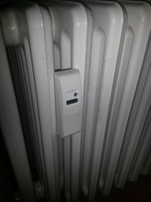

# openhab-binding-wmbus

This is a binding for the [openHAB](https://www.openhab.org/) / eclipse Smart Home home automation system. It aims to make data available to the user, which is already sent by lots of modern metering hardware (e.g. heat cost allocators, electricity/gas/water/heat meters) already widely deployed in houses and especially flats.

The binding is based on the [jMBus](https://www.openmuc.org/m-bus/) library, which provides all basic receiving and decoding. It is currently using version 3.1.1 plus one extension for access to the RAW frame.
Implementation of the Techem devices has been ported from [FHEM](https://forum.fhem.de/index.php/topic,42232.html).

The binding is working stable. To use it, you need a device to receive the transmissions. The underlying library supports transceivers of Amber, Radiocrafts (RC1180-MBUS) and IMST (iM871A-USB), the binding is mainly developed and tested with the [Amber Wireless AMB8465-M](https://www.we-online.de/catalog/en/USB_RADIO_STICK_METERING).
However, development is still going on and there are some known issues.

### Features:
* Receive WMBus frames as inbox discovery results
* Filter results by WMBus IDs
* Add discovery results as new things
* Decrypt encrypted WMBus messages if key is available
* Display and update data in channels/linked thing items
* Old discovery results get removed from the inbox, the "time to live" can be configured (default 24 hours)
* Things that were not received for a while will change state to "Offline" (timeout can be configured per device, default 60 minutes)

### Supported Devices:
* Everything that's standard WMBus/OMS as supported by the underlying jMBus library
* Many Techem devices (There are several versions, most should be already implemented. If you find an unsupported device showing up as "Encrypted" and throwing errors in the log, please send us the log excerpts and we try to implement them. Many devices also store and send bi-weekly consumption wrapups. We named this field "Almanac" in the implementation and did not implement it yet. There may be other fields/flags that we did not discover or whose meaning we did not decode yet)
  * heat cost allocators
  * water/warm water meters (The ID of the meter is different to the ID of the radio module that is transmitted and shows up in the inbox, so you will have to compare readings to find your own meters.)
  * heat meters (branded Hydrometer/Diehl Metering Sharky devices)

### Currently unsupported known devices
* Techem Smoke detectors (earlier work at [FHEM](https://forum.fhem.de/index.php?topic=18422.90))
* Ista devices (very hard to implement, because they don't send periodically but only when getting polled, see [PDF](https://www.ista.com/fileadmin/twt_customer/countries/content/Germany/Documents/Loesungen/Funk/Basistechnik/Produktbroschuere_Funksystem_symphonic-sensor-net.pdf) )

There is some more information and discussion [in the forum](https://community.openhab.org/t/new-binding-wireless-m-bus-techem-heat-cost-allocators/16974).

## Images




## Install
1. Drop the .jar from https://github.com/KuguHome/openhab-binding-wmbus/releases (or your own build, see below) into your openHAB Karaf deploy directory, e.g. `openhab/addons` or `/usr/share/openhab/addons/`.
2. It should get picked up automatically and started by Karaf.
3. Run `bundle:list` in the [OSGi console](https://www.openhab.org/docs/administration/console.html), it should show a `wmbus` bundle in active state. If it is there but not active yet, try `feature:install openhab-transport-serial` or `bundle:start XXX` where `XXX` is the number of the wmbus bundle shown by the `list` command.
4. Open OH3 UI in the browser.
5. Check that `Settings` -> `Things` -> `(+)` lists the WMBus Binding.
6. Configure WMBus Binding: Set `include the BridgeUID (stick/adapter name) into the ThingUID of the metering device` to `true`.
7. Manually add new WMBus Binding Thing -> WMBus Stick (exactly one).
8. Select/enter serial device (e.g. `/dev/ttyUSB0`, check via `dmesg` when plugging in the stick) as configuration parameter.
9. Select receiving mode. T is most common, will also receive frames sent in mode C. S is transmitting only rarely.
10. The Thing should show `ONLINE` as status. If not, edit the Thing, this screen should include some more error details, also check OSGi console and `userdata/logs/openhab.log` or `/var/log/oppenhab/openhab.log`.
11. If everything is working correctly, devices should be discovered automatically and turn up as new Things in the Inbox as soon as a message is received from them. Manually adding the devices is not necessary, also the active search function when adding a Thing does nothing. Everything goes throught the discovery.
12. Search your devices in the Inbox by the ID that is printed outside or shown on the display (e.g. Techem HKVs display the last 4 digits) and add those devices via the checkmark button. Make sure "Item Linking Simple Mode" is activated or link the channels to items yourself.
13. On the "Control" page, the Thing with it's different channels should display, readings should be updated regularly about every 4 minutes:
  * Room/radiator temperature etc. are always current (at the time of sending/receiving the message).
  * Some device's "Current Reading" will only update once each day.
14. If a Persistence Add-on (e.g. InfluxDB) is installed, the readings will also be stored into the database.
15. In OH3 UI, diagrams/charts/graphs can be configured to have a look at the latest values in comparison. Grafana is a good third party software to get an overview.
16. If any Exceptions or other messages turn up in the logs or console, please let us know and open an issue here.

### Encrypted messages
If your device is encrypted, you will need to get the AES key from the manufacturer, metering company or landlord. Then
1. Discover device as usual (see 10.-12. above), it will be shown as "Encrypted Device", add it as a thing.
2. Edit the thing configuration and input the AES key as one hex string in the appropriate field.
3. Next time a message of this devices is received, it will be decrypted and the Thing will change automatically, making the channels available.
4. Continue with steps 12.-16.

## Build

1. Run `mvn package` in the root directory..
2. The compilation result will be at `org.openhab.binding.wmbus/target/org.openhab.binding.wmbus-3.1.0-SNAPSHOT.jar`.

## Development

1. Install OpenHAB IDE according to their webpage. This is basically Eclipse IDE + Oomph + OpenHAB dev addons via Oomph.
2. Clone this repository.
3. File - Import - Maven - Existing Maven Projects. Give path to this git repository, select all three projects, add project to working set "WMBus" or similar.

For debugging and development, it is helpful to add the folloing to `/var/lib/openhab/etc/org.ops4j.pax.logging.cfg` to log to a separate file `/var/log/openhab/wmbus.log`

```
# Define WMBus file appender
log4j2.appender.wmbus.type = RollingRandomAccessFile
log4j2.appender.wmbus.name = WMBUS
log4j2.appender.wmbus.fileName = ${openhab.logdir}/wmbus.log
log4j2.appender.wmbus.filePattern = ${openhab.logdir}/wmbus.log.%i
log4j2.appender.wmbus.append = true
log4j2.appender.wmbus.layout.type = PatternLayout
log4j2.appender.wmbus.layout.pattern = %d{yyyy-MM-dd HH:mm:ss.SSS} [%-5.5p] [%-36.36c] - %m%n
log4j2.appender.wmbus.policies.type = Policies
log4j2.appender.wmbus.policies.size.type = SizeBasedTriggeringPolicy
log4j2.appender.wmbus.policies.size.size = 100MB

# Configure WMBus logging
log4j2.logger.org_openhab_binding_wmbus.level = TRACE
log4j2.logger.org_openhab_binding_wmbus.name = org.openhab.binding.wmbus
log4j2.logger.org_openhab_binding_wmbus.additivity = false
log4j2.logger.org_openhab_binding_wmbus.appenderRefs = wmbus
log4j2.logger.org_openhab_binding_wmbus.appenderRef.wmbus.ref = WMBUS
```

## Raw tool
There is an additional tool, that compiles as a second .jar file `org.openhab.binding.wmbus.tools-3.1.0-SNAPSHOT.jar` (also available from the releases page). If you drop this bundle into your addons folder or install it otherwise to openHAB, you can access the tool at http://localhost:8080/wmbus. It gives you the ability to inject frames to the binding, as if they were received via a stick. There is also a collector, which lists you each received WMbus frame as raw hex, together with timestamp and basic grouping (ID, Manufacturer, device type).
If you add the following lines to `/var/lib/openhab/etc/org.ops4j.pax.logging.cfg`, you can also log all frames to a plaintext file `wmbustools.log`. The content of that file can later be fed to the injector.

```
# Define WMBus Tools file appender
log4j2.appender.wmbustools.type = RollingRandomAccessFile
log4j2.appender.wmbustools.name = WMBUSTOOLS
log4j2.appender.wmbustools.fileName = ${openhab.logdir}/wmbustools.log
log4j2.appender.wmbustools.filePattern = ${openhab.logdir}/wmbustools.log.%i
log4j2.appender.wmbustools.append = true
log4j2.appender.wmbustools.layout.type = PatternLayout
log4j2.appender.wmbustools.layout.pattern = %m%n
log4j2.appender.wmbustools.policies.type = Policies
log4j2.appender.wmbustools.policies.size.type = SizeBasedTriggeringPolicy
log4j2.appender.wmbustools.policies.size.size = 100MB

# Configure WMBus Tools logging
log4j2.logger.org_openhab_binding_wmbus_tools.level = DEBUG
log4j2.logger.org_openhab_binding_wmbus_tools.name = org.openhab.binding.wmbus.tools.LoggingMessageListener
log4j2.logger.org_openhab_binding_wmbus_tools.additivity = false
log4j2.logger.org_openhab_binding_wmbus_tools.appenderRefs = wmbustools
log4j2.logger.org_openhab_binding_wmbus_tools.appenderRef.wmbustools.ref = WMBUSTOOLS
```

## Licenses

This binding is released under EPL-1.0, the included jmbus is under MPL-2.0.
